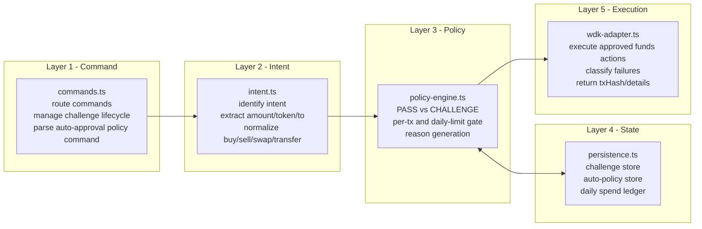

# PolicyGuard OpenClaw Plugin

## Overview
PolicyGuard is a deterministic safety layer that turns AI wallet actions from **direct execution** into **policy-gated, human-approved execution** on top of OpenClaw + WDK.

## Problem
In AI-agent trading/wallet workflows, the core risk is not model intelligence but uncontrolled fund operations.

Typical failure modes:
- Misinterpreted user intent triggers transfer/swap
- Prompt injection or social-engineering requests money movement
- Duplicate approvals/repeated execution
- Weak post-incident auditability

## Technical Highlights
1. **Deterministic policy boundary (LLM-independent)**
   - Funds intents default to `CHALLENGE`
   - Non-funds intents can `PASS`

2. **Challenge state machine + durable persistence**
   - Lifecycle: `PENDING -> APPROVED/REJECTED`
   - Atomic JSON persistence

3. **Idempotent approval guard**
   - Duplicate `/approve` on non-PENDING challenge is blocked

4. **Structured execution/error model**
   - Error taxonomy: `RPC | ALLOWANCE | GAS | BALANCE | TIMEOUT | UNKNOWN`
   - Deterministic next-step outputs

5. **OpenClaw + WDK integration**
   - OpenClaw tool entry (`policyguard_command`)
   - WDK execution adapter for approved funds actions
   - `txHash` returned when on-chain execution succeeds

## Quickstart

Install plugin from npm (latest):
```bash
openclaw plugins install policyguard-openclaw-plugin
```

Optional version pin:
```bash
openclaw plugins install policyguard-openclaw-plugin@0.1.1
```

Set runtime seed env:
```bash
export WDK_SEED="<your mnemonic>"
```

Recommended plugin config:
```json
{
  "plugins": {
    "policyguard-openclaw-plugin": {
      "persistencePath": "./data/pending-challenges.json",
      "wdkSeedEnvKey": "WDK_SEED",
      "chain": "arbitrum",
      "accountIndex": 0,
      "rpcUrl": "https://arb1.arbitrum.io/rpc",
      "swapProtocolLabel": "velora",
      "swapMaxFee": "0.003"
    }
  }
}
```

Sanity checks:
```bash
npm run build
npm test
npm run validate
```

## Tech Details

### 1) End-to-end flow (natural language -> execution)

```mermaid
flowchart TD
    U[User natural-language request] --> OC[OpenClaw tool call: policyguard_command]
    OC --> C[Command Layer\nparse /policy /approve /reject]
    C --> I[Intent Layer\nnormalize + extract entities]
    I --> P[Policy Layer\ndeterministic risk decision]
    P -->|PASS| E[Execution Adapter\nWDK / non-funds route]
    P -->|CHALLENGE| S[Challenge Store\npersist PENDING]
    S --> A[/approve challengeId/]
    A --> C
    E --> TX[On-chain execution]\n
    TX --> R[Response\ndecision + txHash/error]
    C --> R
```

What this layer flow does:
- Accept user natural language through OpenClaw tool entry
- Convert text to structured intent + policy decision
- Require explicit approval for risky funds actions
- Return auditable output (`challengeId`, `txHash`, structured errors)

### 2) Layered architecture



What each layer contributes:
- **Command**: user-facing control surface and approval state transitions
- **Intent**: deterministic entity extraction from natural language
- **Policy**: risk decisioning and quota checks
- **State**: durable audit and quota continuity across sessions
- **Execution**: controlled WDK execution and observable output contract

---

Reference narrative: `AWARD_PITCH.md`  
Hackathon rules context: https://hcni4f4mdq79.feishu.cn/wiki/LVzIwMpmKixXeHkeQQ0c8sn8nWg
