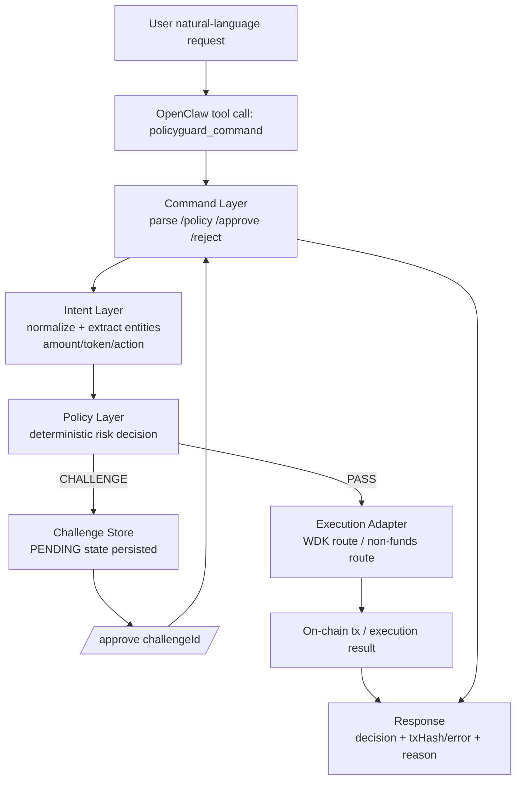
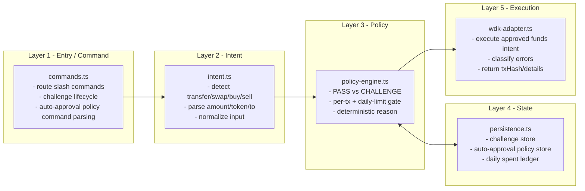

# PolicyGuard OpenClaw Plugin

**PolicyGuard = WDK execution safety layer for OpenClaw.**  
Integration path: `OpenClaw Tool -> PolicyGuard -> WDK -> Chain`

This plugin enforces a deterministic approval boundary before funds-related actions execute:
- `PASS`: safe/non-funds intent can proceed
- `CHALLENGE`: funds intent requires explicit human approval

## End-to-end flow (Natural language -> execution)



## Layered architecture (what each layer does)



## Per-layer operation details

1. **Command Layer (`src/commands.ts`)**
   - Receives `/policy`, `/approve`, `/reject`
   - Parses authorization command for auto-approval limits
   - Applies challenge state transitions (`PENDING -> APPROVED/REJECTED`)

2. **Intent Layer (`src/intent.ts`)**
   - Converts natural language into structured intent
   - Extracts fields (`amount`, `token_in`, `token_out`, `to`)
   - Normalizes buy/sell/swap/transfer variants

3. **Policy Layer (`src/policy-engine.ts`)**
   - Deterministic decisioning
   - Default funds behavior: challenge-first
   - Optional auto-approval guard by per-tx and daily caps

4. **State Layer (`src/persistence.ts`)**
   - Persists challenge records
   - Persists auto-approval policy
   - Persists daily-spend ledger for quota checks

5. **Execution Layer (`src/wdk-adapter.ts`)**
   - Executes approved funds intents through WDK path
   - Returns structured result (`txHash`, category, next-step)
   - Classifies runtime failures for operation handling

---

## README Scoring Map (Criterion -> Evidence)

| Scoring Criterion | Delivered Evidence in Repo | How to Verify Quickly |
|---|---|---|
| Problem relevance (AI agent fund safety) | README + `AWARD_PITCH.md` problem framing | Read first 2 sections |
| Deterministic safety mechanism | `src/policy-engine.ts`, `src/commands.ts` | Run `/policy ...` and confirm `CHALLENGE` for funds intents |
| Approval gating + idempotency | `src/commands.ts` challenge state transition | Approve same challenge twice and confirm duplicate approve is blocked |
| WDK/OpenClaw integration implementation | `src/index.ts`, `src/wdk-adapter.ts`, `openclaw.plugin.json` | Install plugin and invoke `policyguard_command` |
| Engineering quality | `tests/*`, `package.json` scripts | Run `npm run build && npm test && npm run validate` |

---

## Quickstart (aligned to demo user story)

### a) Install `policyguard-openclaw-plugin`
```bash
openclaw plugins install policyguard-openclaw-plugin
```

(Version pin also works: `openclaw plugins install policyguard-openclaw-plugin@0.1.0`)

### b) Create WDK wallet context
Set the seed env key used by the plugin:
```bash
export WDK_SEED="<your mnemonic>"
```

Recommended plugin config:
```json
{
  "plugins": {
    "policyguard-openclaw-plugin": {
      "persistencePath": "./data/pending-challenges.json",
      "wdkSeedEnvKey": "WDK_SEED",
      "chain": "arbitrum",
      "accountIndex": 0,
      "rpcUrl": "https://arb1.arbitrum.io/rpc",
      "swapProtocolLabel": "velora",
      "swapMaxFee": "0.003"
    }
  }
}
```

### c) Let user transfer some ETH to Arbitrum mainnet
Talk directly to OpenClaw in chat:
1. `/policy transfer <amount> ETH to <address>`
2. Receive `CHALLENGE` + `challengeId`
3. `/approve <challengeId> <reason>`

### d) Monitor hot on-chain tokens, analyze, then buy 1U
Demo user story step (same conversation style):
1. Ask OpenClaw to monitor hot tokens
2. Ask OpenClaw to pick the best opportunity
3. Execute buy with a 1U-sized action through policy challenge + approval flow

---

## Delivered architecture

1. **Command layer** (`src/commands.ts`)
   - Handles `/policy`, `/approve`, `/reject`
   - Maintains challenge state transitions

2. **Policy layer** (`src/policy-engine.ts`)
   - Deterministic PASS/CHALLENGE logic
   - Stable request fingerprinting

3. **Intent layer** (`src/intent.ts`)
   - Extracts entities for transfer/swap flows

4. **Execution adapter** (`src/wdk-adapter.ts`)
   - Routes approved intents into execution paths
   - Normalizes failures into structured categories

5. **Persistence** (`src/persistence.ts`)
   - Durable challenge records for audit and replay analysis

---

## Delivered technical highlights

- Deterministic policy boundary independent from model randomness
- Idempotent challenge lifecycle to prevent duplicate execution
- Transfer + swap intent extraction with canonical parameters
- Runtime safety checks for seed handling (env-only design)
- Structured error taxonomy: `RPC | ALLOWANCE | GAS | BALANCE | TIMEOUT | UNKNOWN`
- Local execution-first architecture for controlled deployment environments

---

## Security constraints (implemented)

- Seed-like plaintext keys in config are rejected at startup
- Use environment variables for sensitive material only

---

## Local verification

```bash
npm install
npm run build
npm test
npm run validate
```

---

## Hackathon context source

- Rules/context link provided by organizer:
  - https://hcni4f4mdq79.feishu.cn/wiki/LVzIwMpmKixXeHkeQQ0c8sn8nWg
